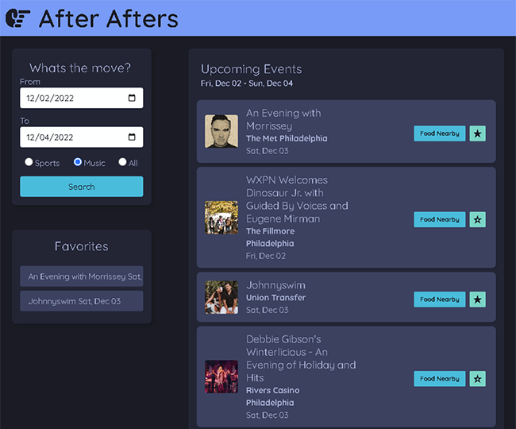
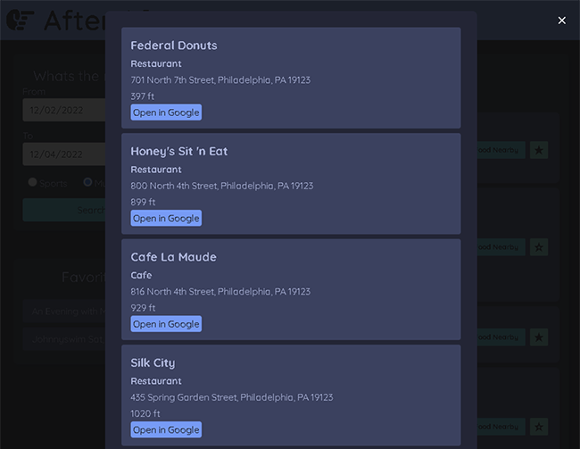
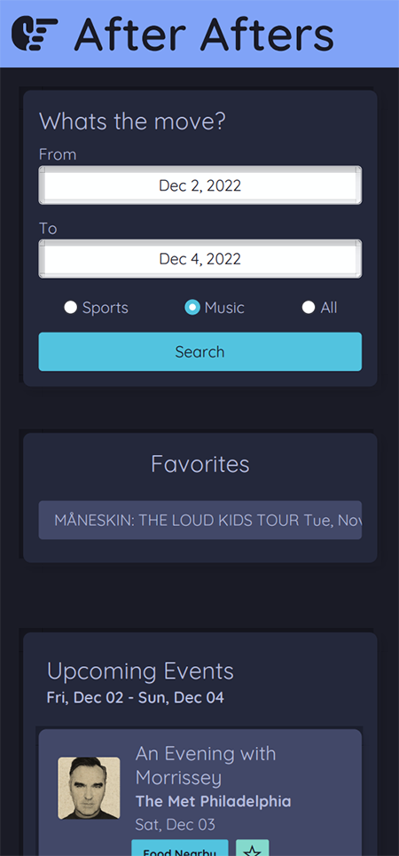

# After Afters

## Description

As Philadelphia residents, we wanted to make a streamlined, easy to use web app that would allow us to make weekend plans.

We all had a common problem - when a show was over, where do we go for food?

This web app will allow the user to find shows in Philadelphia, then search for food within a 15 minute walk of the venue.

## Installation

No install required - simply click the link in the following section

## Usage

To use After Afters, please use the following link: [After Afters](https://antced.github.io/after-afters/)

### Directions

### 1 - Input the desired date range and check off either sports, music, or all

### 2 - Once loaded, you can add favorite events by clicking the star button

### 3 - Click on -Food Nearby- button to view what food or bars are within a 15 minute walk of the venue

### Mobile layout

## Credits

This project was developed by:

- [antced](https://github.com/antced)

- [ChelsRunnn](https://github.com/ChelsRunnn)

- [Tooboi](https://github.com/Tooboi)

## License

[MIT License](./license)

## Technologies + Languages

